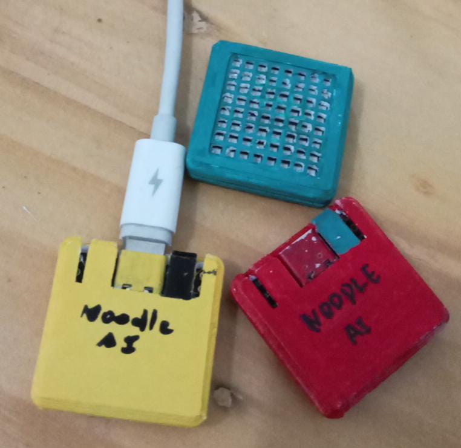

# NoodleAI Web

<p align="center">
  <br>
  <em>EP32-S3 Matrix inside a case (https://www.thingiverse.com/thing:6949072).</em>
</p>


**Collect. Train. Upload. Infer.**

NoodleAI Web is a friendly, browser-based TinyML playground for the **Waveshare ESP32-S3-Matrix**.

With only a browser and Bluetooth, you can:

- see the board's motion live,
- collect your own gesture examples,
- train a small neural network,
- send the trained model to the board,
- and run the model directly on the ESP32-S3.

No Python installation is required for the web version, and the gesture data does not need to leave your computer.

> **Try it here:** https://auralius.github.io/nai/

---

## What can you teach with it?

NoodleAI is designed to make machine learning easy to *see*.

A simple classroom activity can be:

1. Draw the numbers `1`, `2`, and `3` in the air.
2. Record several examples of each gesture.
3. Train a neural network in the browser.
4. Watch the training curves improve.
5. Upload the trained model to the ESP32-S3.
6. Draw another number and let the board predict it.

The basic idea is:

```text
motion
  ↓
IMU sensor
  ↓
training examples
  ↓
neural network
  ↓
trained model
  ↓
ESP32-S3 prediction
```

---

## Hardware

The current NoodleAI Web demo uses:

- **Waveshare ESP32-S3-Matrix**
- onboard **QMI8658** 6-axis IMU
  - accelerometer: `ax, ay, az`
  - gyroscope: `gx, gy, gz`
- onboard 8×8 RGB LED matrix
- BOOT button for marking the start and end of a gesture

The board samples motion at **50 Hz**.

---

## Browser requirements

NoodleAI Web uses **Web Bluetooth**.

Recommended:

- Google Chrome or Chromium
- Microsoft Edge
- Bluetooth-enabled computer

The hosted GitHub Pages version already uses HTTPS, which is required for Web Bluetooth.

### Linux note

On some Linux installations, Web Bluetooth may need to be enabled manually.

In Chrome/Chromium, try:

```text
chrome://flags/#enable-experimental-web-platform-features
```

Enable **Experimental Web Platform features**, relaunch the browser, and try again.

---

# Quick start

## 1. Open NoodleAI Web

Go to:

https://auralius.github.io/nai/

Click **Connect** and choose the `NoodleAI` device from the browser Bluetooth dialog.

When connected, the top bar should show live accelerometer and gyroscope values.

---

## 2. Look at the live IMU

Open the **Live IMU** tab.

Move and rotate the board.

You should see two live plots:

- acceleration
- angular rate

This is the raw motion data coming directly from the board over Bluetooth.

```text
ESP32-S3
   │
   │ raw ax, ay, az, gx, gy, gz
   ▼
Web Bluetooth
   │
   ▼
Browser
```

---

## 3. Create a dataset

Open **Dataset & Train**.

Choose a **Normalized gesture length**. The default is:

```text
100 points
```

Then define the classes you want the model to learn.

For a first experiment, try:

```text
1
2
3
```

or:

```text
1
2
3
4
```

Click **Lock setup** when the labels are ready.

---

## 4. Record examples

Choose a label.

Click **Use BOOT to record**.

Then:

```text
hold BOOT
   ↓
draw the gesture in the air
   ↓
release BOOT
```

NoodleAI records the complete gesture between BOOT press and BOOT release.

You can then:

- **Save sample**
- **Discard**

Try to collect several examples for every class.

More varied examples usually help the model generalize better.

---

## 5. Choose the input representation

The same raw 6-axis gesture data can be transformed into different input representations.

Current options include:

| Representation | Channels | Example input size at 100 points |
|---|---:|---:|
| Accelerometer | 3 | 300 |
| Gyroscope | 3 | 300 |
| Accel + Gyro | 6 | 600 |
| Relative Quaternion | 4 | 400 |
| Estimated Velocity | 3 | 300 |
| Velocity + Quaternion | 7 | 700 |

For a first classroom demo, **Accelerometer** is a good place to start.

A 100-point accelerometer gesture becomes:

```text
100 points × 3 channels = 300 inputs
```

---

## 6. Choose the neural network

Enter the hidden layers as comma-separated numbers.

For example:

```text
64,32,16
```

With 300 inputs and 4 classes, this gives:

```text
300 → 64 → 32 → 16 → 4
```

This is a small multilayer perceptron (MLP).

You can experiment with smaller or larger networks and see how the behavior changes.

---

## 7. Train in the browser

Choose the number of epochs and click **Train**.

Training runs locally in the browser using **TensorFlow.js**.

Nothing needs to be sent to a cloud training server.

Open **Training Curves** to watch:

- training loss
- validation loss
- training accuracy
- validation accuracy

A healthy training run usually shows the loss decreasing while accuracy increases.

Do not worry if the result is not perfect. A failed prediction is often a useful chance to discuss training data and generalization.

---

## 8. Save the model

After training, NoodleAI creates a model package in the current **NAI** format.

Click:

**Save .nai package**

The package contains the information needed by the embedded runtime, including:

- model topology
- preprocessing metadata
- feature-scaling parameters
- neural-network weights
- neural-network biases
- class labels

The numerical model parameters are stored as compact binary data.

---

## 9. Deploy to the ESP32-S3

Open **Deploy & Infer**.

Click:

**Deploy to device**

The browser sends the NAI model directly to the ESP32-S3 over Bluetooth.

```text
TensorFlow.js
     ↓
NAI model
     ↓
Web Bluetooth
     ↓
ESP32-S3 flash
     ↓
Noodle runtime
```

The application firmware does **not** need to be recompiled when only the trained model changes.

---

## 10. Run inference

Switch the device to:

**INFERENCE MODE**

Now hold BOOT, draw a gesture, and release BOOT.

The ESP32-S3 performs the preprocessing and runs the neural network locally using **Noodle**.

The prediction appears:

- in the web interface,
- and on the board's LED matrix for supported labels.

```text
gesture
   ↓
ESP32-S3
   ↓
feature representation
   ↓
Noodle MLP
   ↓
prediction
```

---

# Saving and loading datasets

NoodleAI Web can save datasets as `.npz` files.

A dataset stores:

- class labels
- normalized examples
- raw 6-axis gesture samples
- gesture lengths
- gesture durations
- sampling information

Because the raw IMU gestures are retained, one dataset can be reused to experiment with different motion representations.

You can therefore collect once and later compare:

```text
Accelerometer
vs.
Gyroscope
vs.
Accel + Gyro
vs.
Quaternion
vs.
Estimated Velocity
```

without recording the whole dataset again.

---

# What is the NAI model?

**NAI** is the model package used by NoodleAI.

It separates the trained model from the application firmware.

That means the workflow can be:

```text
train a different model
        ↓
generate a new .nai
        ↓
upload over Bluetooth
        ↓
run it immediately
```

instead of:

```text
change model
   ↓
edit firmware
   ↓
compile
   ↓
flash firmware again
```

This makes it convenient for classroom experiments where students want to try different:

- labels,
- network sizes,
- input representations,
- datasets,
- and training settings.

---

# What runs where?

```text
┌─────────────────────────────┐
│ Browser                     │
│                             │
│ Web Bluetooth               │
│ Dataset management          │
│ Motion feature generation   │
│ TensorFlow.js training      │
│ Training curves             │
│ NAI model generation        │
└──────────────┬──────────────┘
               │ Bluetooth
               ▼
┌─────────────────────────────┐
│ ESP32-S3-Matrix             │
│                             │
│ QMI8658 IMU                 │
│ Gesture acquisition         │
│ Motion preprocessing        │
│ Noodle inference runtime    │
│ 8×8 LED output              │
└─────────────────────────────┘
```

A useful design rule in NoodleAI is:

> **Bluetooth transports raw measurements, not interpretations.**

The browser receives the raw IMU stream, so more advanced algorithms and representations can be explored later without changing the basic BLE sensing interface.

---

# Why NoodleAI?

NoodleAI is intended to make embedded AI less mysterious.

Students can inspect:

- what the sensor measures,
- how many values enter the neural network,
- the topology of the MLP,
- the training curves,
- the generated model,
- and the final embedded prediction.

The goal is not only to get a correct answer from a neural network, but also to understand the path from **data to model to device**.

---

# A simple classroom challenge

Try this with a group of students:

1. One student records 10 examples each of `1`, `2`, and `3`.
2. Train the model.
3. Test it with the same student.
4. Give the board to another student.
5. Test again.

Questions to discuss:

- Does the accuracy change?
- Why?
- Did the first dataset contain enough variation?
- Would more examples help?
- Does a different representation help?
- Does a larger neural network always improve the result?

This naturally introduces ideas such as:

- training data
- validation
- generalization
- overfitting
- model size
- sensor representation

without needing to begin with heavy mathematics.

---

# Repository structure

A typical web branch contains:

```text
/
├── index.html
├── style.css
├── README.md
└── js/
    ├── app.js
    ├── ble.js
    └── core.js
```

The application is static and can be hosted directly with **GitHub Pages**.

---

# Local development

For local testing, serve the files with a small static HTTP server:

```bash
python3 -m http.server 8000
```

Then open:

```text
http://localhost:8000
```

The Python command only serves the HTML, CSS, and JavaScript files.

Training still happens entirely inside the browser.

---

# Troubleshooting

### The NoodleAI device does not appear

Check that:

- the ESP32-S3 is powered,
- Bluetooth is enabled,
- the correct NoodleAI firmware is running,
- another application is not already connected to the board.

### Web Bluetooth is unavailable

Use a browser with Web Bluetooth support.

On Linux, try enabling:

```text
chrome://flags/#enable-experimental-web-platform-features
```

### The gesture is too short

Hold BOOT a little longer while drawing.

### Training accuracy is high but new gestures fail

Collect more varied training examples. Try different speeds, sizes, and small orientation changes.

### Deployment fails

Reconnect the board and try again. A smaller BLE chunk size may help on some host Bluetooth stacks.

---

# Privacy

NoodleAI Web is designed to run locally in your browser.

The gesture dataset, feature generation, neural-network training, and model packaging do not need to leave your computer.

The browser communicates directly with the nearby ESP32-S3 over Web Bluetooth.

---

# Project status

NoodleAI Web is an educational and experimental TinyML platform.

Current focus:

- gesture learning from IMU data,
- browser-side training,
- runtime model deployment,
- transparent embedded inference,
- and classroom-friendly experimentation.

More models, sensors, and learning activities can be added later.

---

## Have fun experimenting! 🍜🤖

Try changing the data, the representation, or the network and see what happens.

That is the point of NoodleAI: **make the machine-learning pipeline something you can touch, change, and understand.**
